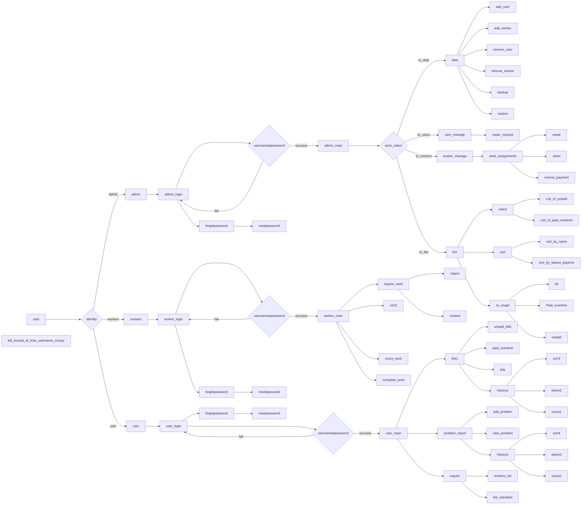

```mermaid
graph LR
start --> choose{identity}
choose --> |admin| admin
choose --> |user| user
choose --> |workers| workers

admin --> admin_login
admin_login ---> verify1{username&password}
admin_login --> forget1[forgetpassword]
forget1 --> reset1[resetpassword]
verify1 --> |success| admin_main
verify1 --fail--> admin_login
admin_main --> work_select1{work_select}
work_select1 --> |to_users| user_manage
work_select1 --> |to_workers| worker_manage
work_select1 --> |to_fee| fee
work_select1 --> |to_data| data
data --> add_user
data --> add_worker
data --> remove_user
data --> remove_worker
data --> backup
data --> restore
user_manage --> repair_request
fee --> select
fee --> sort
fee --> to_singal
select --> List_of_unpaid
select --> List_of_paid_overtime
sort --> sort_by_name
sort --> sort_by_lastest_paytime
to_singal --> bil
to_singal --> Paid_overtime
to_singal --> unpaid
worker_manage --> work_assignments
work_assignments --> repair
work_assignments --> clean
work_assignments --> remind_payment

workers --> worker_login
worker_login --> verify2{username&password}
worker_login --> forget2[forgetpassword]
forget2 --> reset2[resetpassword]
verify2 --> |success| worker_main
verify2 ---> |fail| worker_login
worker_main --> inquire_work
worker_main --> sort2
worker_main --> count_work
worker_main --> complete_work
inquire_work --> region
inquire_work --> content

user --> user_login
user_login --> verify3{username&password}
user_login --> forget3[forgetpassword]
forget3 --> reset3[resetpassword]
verify3 --> |success| user_main
verify3 ----> |fail| user_login
user_main --> fee1
user_main --> problem_report
user_main --> inquire
fee1 --> unpaid_bills
fee1 --> paid_overtime
fee1 --> pay
fee1 --> history1
history1 --> sort3
history1 --> select2
history1 --> count1
problem_report --> add_problem
problem_report --> view_problem
problem_report --> history2
history2 --> sort4
history2 --> select3
history2 --> count2
inquire --> workers_list
inquire --> fee_standard

bill_include_id_time_username_money
```