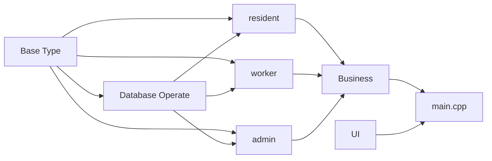

## Properties Management

> This is a class work for C course of NEU.

### project framework(for example)

##### Base Type
It should include some commonly used data structures, such as  
string, list, stack, deque and others.  
All of structures(except str) should get a sizeof the detail data  
struct, and is should return a void pointer.  
The void pointer should be change to the data on its own, then be  
read and operated.
##### DateBase Operate  
This is a module for operating databases.  
We assume that the data to be stored is always of string type.
It should support basic CRUD operations(Create, Read, Update, Delete),  
as well as any other operations deemed necessary.
##### resident, worker, admin  
Abstract business of the project.
##### Business  
Specific business of the project.
##### UI  
a UI module. 

### coding standard  
pass 
