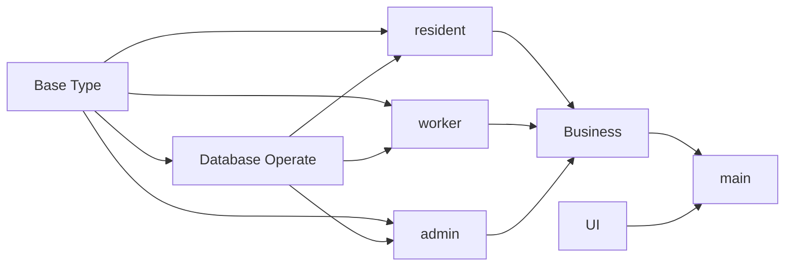

# Properties Management

> <strong><big><green>This is a class work for C course of NEU.</green></big></strong>

## project framework(for example)

#### Base Type
It should include some commonly used data structures, such as string, list, dict, map and others.  
The type of list should get a sizeof the detail data struct, and is should return a untyped pointer.  
Then the untyped pointer should be changed to the data on its own type, then be read and operated.  
#### DateBase Operate  
This is a module for operating databases.  
We assume that the data to be stored is always of string type.  
It should support basic CRUD operations(Create, Read, Update, Delete), as well as any other operations deemed necessary.  
#### resident, worker, admin  
Abstract business of the project.
#### Business  
Specific business of the project.
#### UI  
Using Gtk2 for the UI of the project.  
Download the library from the [Internet](https://archive.org/download/Gtk-bundle_2.22.1-20101229_win64) and unzip it to a folder which its path is without spaces.  
Then add the system environment variable `C_INCLUDE_PATH` to the path of the folder.


## coding standard  
The code should strive for beauty and elegance.  
#### naming variables/types/functions
> If a name begins with an underscore, then you should use it carefully.  
> It is a symbol that the variable/type/function may not be used directly.  

Variables are generally named using one or two nouns connected by underlines.  
Types are typically expressed using one or two nouns as well as variables.  
Functions are usually composed of three words, in two forms:  
1. noun+verb+noun, sometimes the seconed noun could be ingore, like `list_get`, `db_select_lin`  
2. verb+prep+noun, like `sort_by_username`  

_names should be simple and understandable with uniqueness, and repetition is not recommended_

#### indentation
Indentation should be done using 4 spaces instead of one tab.  
Reason: spaces have a consistent width of one character on all devices, while tabs depend on platform implementation. 

#### braces and code blocks
The left brace should directly follow control statements or the definition of function.  
The right brace should be one of the same indentation level as the corresponding statement.  
Indent inside the code block by adding 4 spaces.
For example:
```C
int max(int one, int two){
    if( one > two ){
        return one;
    } else {
        return two;
    }
}
```

## commit standard
The commit message should be written as the format below:
```
<type>: <description>
```
#### type
The `<type>` should be one of the following:
- feat: a new feature
- fix: a bug fix
- docs: documentation only changes
- style: changes that do not affect the meaning of the code (white-space, formatting, missing semicolons, etc.)
- refactor: a code change that neither fixes a bug nor adds a feature
- perf: a code change that improves performance
- chore: changes to the build process or auxiliary tools and libraries such as documentation generation
- revert: revert to a commit
- merge: merge branch
#### description
The `<description>` should be a short, concise description of the changes made.  
It should be written by Chinese or English, and the Chinese description is recommended.

## development standard
The development should be done in the branch `develop`, and the developing branch should be merged into `master` every week.  
The branch `master` should be the latest stable version of the project.
The branch `omega` will be developed in parallel with another branch, And is could be an example and a guide.
