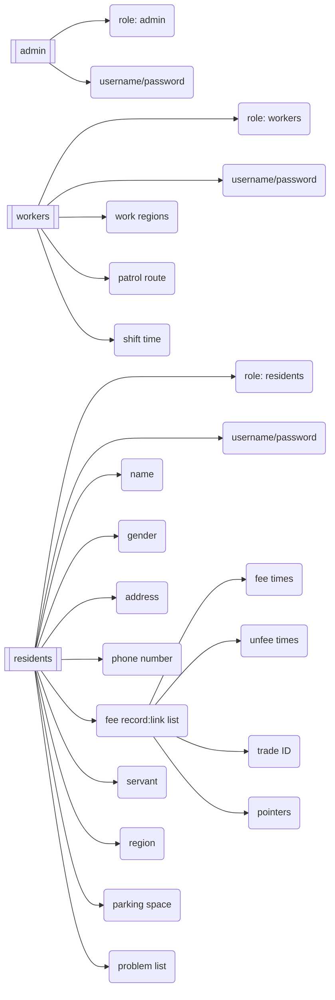

## user data struct

enum role

```mermaid
graph LR
A[["admin"]]
A --> A1(role: admin)
A --> A2(username/password)

B[[workers]]
B ---> B1(role: workers)
B ---> B2(username/password)
B --> B3(work regions)
B --> B4(patrol route)
B --> B5(shift time)

C[[residents]]
C ---> C1(role: residents)
C ---> C2(username/password)
C --> C3(name)
C --> C4(gender)
C --> C5(address)
C --> C6(phone number)
C --> C7(fee record:link list)
C --> C8(servant)
C --> C9(region)
C --> C10(parking space)
C --> C11(problem list)
C7 --> c1(fee times)
C7 --> c2(unfee times)
C7 --> c4(trade ID)
C7 --> c3(pointers)
```

need an analysis function to change some statues(fee or not) in database